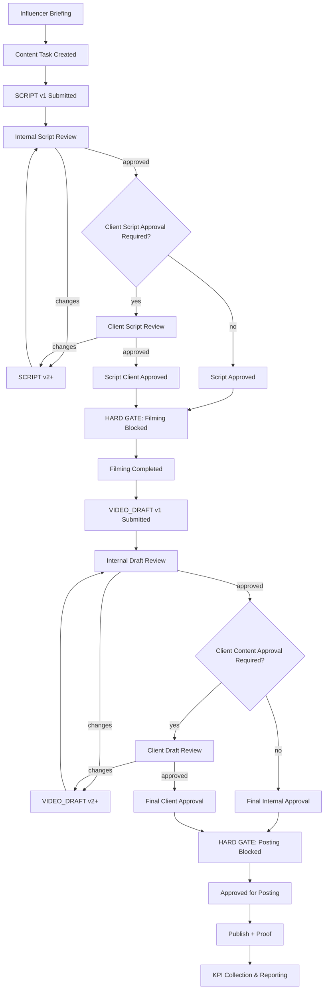

---

# 📘 TiKiT OS — Product Requirements Document (FINAL PRD)

**Product:** TiKiT OS — Campaign Execution & Intelligence  \
**Version:** 1.0 (Final / Locked / Authoritative)  \
**Status:** Approved — Locked  \
**Created by:** Adi Mustapha  \
**Reviewed by:** Cherif Hamadi  \
**Powered by:** PrecisionFlow by AK  \
**For:** TiKiT  \
**Confidential Document**  \

**Audience:** Executive stakeholders, Product, Engineering, Design, Operations, Finance, QA  \
**Owner:** TiKiT Product  \
**Core principle:** **Campaign is the OS container**. Everything is orchestrated through Campaign.

---

## Executive Summary

TiKiT OS is an enterprise-grade operating system for influencer marketing agencies that exists to enforce governance, accountability, and intelligence across the entire campaign lifecycle using the campaign itself as the single operating container.

TiKiT OS addresses the real reasons modern influencer campaigns fail — not a lack of creativity, but weak governance: unclear briefs, misaligned creators, missing approvals, budget drift, fragmented tools, and poor closure discipline. By making the **campaign** the authoritative execution spine, TiKiT OS ensures that every decision, approval, deliverable, KPI, and financial movement is traceable, auditable, and aligned, delivering confidence to clients, protection to agencies, and scalable operations.

---

## 0) Document Governance and Anti-Drift Charter

### 0.1 Canonical Authority

This PRD is the **single source of truth** for TiKiT OS (Campaign Execution & Intelligence).\
All repo PRDs and implementation must align.

### 0.2 Hard Language Ban

The following terms must not appear anywhere in:

- product name, entity model, UI copy, architecture, docs, PRDs

**BANNED:** `ticket`, `tickit`, `kit`, `side kit`, any “support/ticketing” metaphor (`queue`, `inbox`, `SLA`, `agent inbox`).

### 0.3 Approved Canonical Terms

Use:

- **Campaign**
- **Workflow Item**
- **Content Task**
- **Approval Item**
- **Operational Task**
- **Financial Object**
- **Risk Flag / Risk Level**
- **Closeout Meeting**
- **CX Survey**
- **Post-Mortem**
- **Lessons Learned**
- **Best Practices**
- **Final Intelligence Document**
- **Closed & Locked**

---

## 1) Product Overview

This section translates the **core principle — Campaign as the OS container** — into concrete product intent, scope, and boundaries, bridging the executive vision into operational reality.

### 1.1 Problem

Agency operations are currently fragmented across email/WhatsApp/spreadsheets/docs, causing:

- unclear brief interpretation and rework
- influencer selection misalignment
- missing approvals (brief/content)
- schedule slips with no governance
- inconsistent KPI tracking/reporting
- budget drift without clean traceability
- weak closure discipline and loss of institutional learning

### 1.2 Mission

**TiKiT OS exists to run influencer marketing campaigns with enterprise-grade governance, intelligence, and accountability — using the campaign as the single operating container for decisions, approvals, production, finance, and learning.**

The full operational lifecycle executed by TiKiT OS is:

**Brief Intake → AI Structuring → Strategy → Internal Approval → Client Approval → Creator Matching → Client Shortlist Approval → Influencer Pre-Onboarding → Onboarding & Contract → Content Production → Content Approval → Publishing & Reminders → KPI Collection → Reporting → Financial Closure → Closeout Meeting → CX Survey → Internal Post-Mortem → AI Learnings → Final Client Intelligence Document → Closed & Locked**

### 1.3 What TiKiT OS Is

- Campaign operating system for influencer marketing agencies
- AI-assisted intelligence layer + human governance
- Approval + audit backbone for client and internal approvals
- Financial traceability per campaign
- Learning engine: every campaign produces best practices

### 1.4 What TiKiT OS Is Not

- Not a ticketing system
- Not a generic task manager
- Not a CRM replacement (but contains client profiles relevant to campaigns)
- Not a publishing scheduler platform (can integrate later; v1 supports schedule tracking + proof)
- Not accounting software (but tracks campaign financial objects)

---

## 2) Goals, Non-Goals, Success Metrics

### 2.1 Goals

G1. **Campaign-centric truth:** CampaignID is the spine of execution, approvals, deliverables, KPIs, and financials.\
G2. **AI brief extraction is mandatory:** structured brief becomes canonical and is reused everywhere.\
G3. **Two-layer governance:** internal manager approval + client approval before execution and before influencer outreach.\
G4. **Creator shortlist approval gate:** client approves creators before any influencer receives a brief.\
G5. **Risk-aware operations:** missing info allowed, but **flagged + risk-scored**, visible to all relevant roles.\
G6. **Content governance:** approvals enforced; exceptions are auditable.\
G7. **Client-grade reporting:** campaign report + consolidated portfolio report per client.\
G8. **Financial closure discipline:** budget revisions, expenses, invoices, payments linked to CampaignID.\
G9. **Learning loop enforced:** CX survey + post-mortem + AI learnings delivered as final intelligence.

### 2.2 Non-Goals (PRD1 scope)

- Long-term influencer management/representation (PRD2)
- Full social publishing APIs (optional later)
- Full accounting/ERP replacement
- Automated payments (can integrate later)

### 2.3 Success Metrics (Product KPIs)

- Time: brief upload → structured brief ready → internal approved → client approved
- Time: client shortlist approval cycle duration
- % campaigns launched with unresolved High-risk flags
- Approval latency (brief, shortlist, content)
- On-time publishing rate vs planned schedule
- KPI reporting lead time after publish
- Budget revisions count + documentation completeness
- % campaigns fully closed with CX + post-mortem + final intelligence
- Recurrence reduction of top issues (learning effectiveness)

---

## 3) Personas, Roles, and Permissions

### 3.1 Internal Roles

- **Campaign Manager (CM):** owns structured brief review, strategy, creator shortlist building, influencer onboarding, content governance, schedule tracking, reporting, closeout orchestration.
- **Director / Senior Manager (DIR):** governance authority; approves exceptions; resolves escalations; can waive certain gates with explicit reason.
- **Finance / Ops (FIN):** budget revisions, expenses validation, invoices, payment statuses; closure readiness.
- **Admin (ADM):** settings, templates, permissions, integration configuration.

### 3.2 External Roles

- **Client Approver (CLIENT):** approves structured brief/strategy, approves creator shortlist, approves content (when required), final acceptance, CX survey.
- **Influencer / Creator (INF):** accepts/declines campaign participation, shares pricing, signs contract, submits content, publishes, provides KPI proof.

### 3.3 Permission Themes (Minimum)

- Client sees their portfolio dashboard; cannot see internal notes unless shared.
- Influencer sees only their assigned campaign brief/tasks.
- Director/Finance can see sensitive financial/exception governance.

---

## 4) Canonical Data Model (Entities + Required Fields)

> **Why explicit data modeling matters in TiKiT OS**\
> This section defines the canonical data model intentionally and explicitly. TiKiT OS is designed for **enterprise-grade governance**, where auditability, traceability, and accountability are non-negotiable. Every approval, version, financial movement, and decision must be reconstructible after the fact — for internal governance, client trust, and legal or commercial disputes.

By formalizing entities and required fields, TiKiT OS ensures:

- end-to-end traceability via CampaignID
- clean separation of concerns between campaign, client, influencer, content, and finance
- deterministic approval and exception handling
- future-proof extensibility without breaking historical data

The sections below describe the **minimum canonical entities** required to operate campaigns at senior-agency standards.

### 4.1 Campaign (Primary Root Entity)

The Campaign is modeled as the immutable root entity because it represents the single source of operational truth: every decision, approval, deliverable, financial movement, and learning must be traceable back to one campaign context to ensure governance, auditability, and client trust.

**Campaign fields**

- **CampaignID** (unique immutable ID)
- ClientID (FK)
- CampaignName
- Status (state machine)
- RiskLevel (Low/Medium/High)
- MissingInfoList (structured list + severity)
- CreatedAt / CreatedBy
- UpdatedAt / UpdatedBy
- Policy flags:
  - client\_content\_approval\_required (bool, optional per deliverable type)
  - publishing\_grace\_window\_hours
  - payments\_required\_for\_lock (default true)
  - allow\_execution\_with\_high\_risk (default false; override by DIR)

**Campaign modules**

- Brief (raw + structured versions)
- Strategy (AI + approved version)
- Creator Shortlist (proposed + approved versions)
- Influencer Assignments (approved outreach set)
- Content Tasks
- Approvals & Exceptions
- KPI records
- Reports
- Financial objects
- Closure artifacts (closeout notes, CX, post-mortem, AI learnings, final intelligence)

---

### 4.2 Client Company Profile (First-Class Record)

Client must exist as a profile record in the database.

**Client fields**

- **ClientID**
- Company legal name + brand name
- Industry/category (optional)
- Primary contacts (name, email, role)
- Billing contacts (optional)
- Communication preferences (optional)
- Portfolio rollups:
  - active campaigns
  - closed campaigns
  - spend totals (role-based visibility)
  - performance trends (KPIs aggregated)

**Client dashboard requirement**\
Client must be able to view:

- list of campaigns (status + risk + next action)
- consolidated “portfolio summary”
- each campaign’s deliverables + KPIs + timeline
- final documents (reports, intelligence) once delivered

---

### 4.3 Influencer Profile (First-Class Record)

Influencers exist as profile records in the database and are referenced via InfluencerID.

**Influencer fields**

- **InfluencerID** (unique persistent)
- Display name
- Instagram handle + TikTok handle (and others optional)
- Region/language (optional)
- Category/niche tags
- Audience metrics (optional v1: manual fields)
- Content style notes (optional)
- Compliance docs (optional)
- **Pricing history** (time-stamped records)
- Campaign participation history (derived)

> **Key**: influencers can be assigned to multiple campaigns; campaigns can have multiple influencers.

---

### 4.4 “Shortlisted Creator” Representation (IMPORTANT)

When building a creator shortlist, the system must handle:

#### Case A: Influencer already in system

- Use existing InfluencerID
- Do **not** create a new record
- Use last-known data for preview, but pricing must still be requested per campaign

#### Case B: Influencer not in system

- Create a **stub influencer profile** (minimal record) at shortlist time:
  - temporary InfluencerID generated (or reserved ID)
  - handle, platform, display name, link
  - “Profile completeness status: stub”
- This allows:
  - shortlist approval workflow
  - clean tracking from day 1
- When outreach happens and influencer accepts:
  - profile completion is triggered (collect missing fields)

**Requirement:** shortlist cannot contain “free-floating names”; everything must be tied to an InfluencerID (full or stub).

---

### 4.5 Content Task (Deliverable-Level Execution Unit)

**ContentTask fields**

- ContentTaskID
- CampaignID (required)
- InfluencerID (required)
- DeliverableType (reel/post/story/etc.)
- Requirements snapshot (from structured brief)
- Schedule datetime (agreed)
- Status:
  - draft → submitted → approved\_internal → pending\_client\_approval → approved\_by\_client → approved\_for\_posting → published → kpi\_collected → closed
  - plus exception states when needed
- Assets:
  - draft upload, caption text, hashtags, link, proof screenshot, URL
- Versioning:
  - each new submission increments version

---

### 4.6 Approval Item (Governance Backbone)

ApprovalItem must exist for:

- internal brief approval (CM/MGR)
- client brief approval
- client creator shortlist approval
- internal content approval
- client content approval (optional)
- exception approvals (DIR)
- final acceptance (client)
- closure waivers (DIR/FIN when policy allows)

Fields:

- ApprovalItemID
- CampaignID (required)
- ContentTaskID (optional)
- Type (enum)
- Required role
- Status (requested/approved/rejected/expired)
- RequestedAt / RespondedAt
- Decision notes
- Evidence attachment (optional)

---

### 4.7 Financial Object (Campaign Financial Spine)

No financial object can exist without CampaignID.

Types:

- BudgetSnapshot / BudgetRevision
- Expense
- InfluencerCostLine
- ClientInvoice
- InfluencerInvoice
- PaymentStatusEvent

Core fields:

- FinancialObjectID
- CampaignID (required)
- InfluencerID (required for influencer invoices/costs)
- Amount, currency
- Status (planned/approved/sent/paid/overdue)
- Attachment(s): receipts, invoice PDFs
- Change log

---

## 5) Campaign Lifecycle (Detailed State Machine)

### 5.1 Statuses (Authoritative)

1. **brief\_received**
2. **ai\_structured\_pending\_internal\_review**
3. **campaign\_created** *(campaign exists; can be incomplete)*
4. **awaiting\_internal\_strategy\_validation** *(if separated)*
5. **awaiting\_client\_brief\_approval** *(client approves structured brief + strategy)*
6. **creator\_matching\_in\_progress** *(AI shortlist + CM refinement)*
7. **awaiting\_client\_creator\_shortlist\_approval** *(client approves creators to approach)*
8. **approved\_for\_creator\_outreach** *(system allows influencer contact + pre-onboarding)*
9. **influencer\_pre\_onboarding** *(invites + accept/decline)*
10. **influencer\_onboarding\_contracting** *(pricing request + contract)*
11. **content\_in\_production**
12. **content\_approval\_in\_progress**
13. **scheduled\_for\_publishing**
14. **publishing\_in\_progress**
15. **kpi\_collection\_in\_progress**
16. **reporting\_delivered**
17. **financial\_closure\_in\_progress**
18. **client\_closeout\_meeting\_pending**
19. **cx\_survey\_pending**
20. **internal\_post\_mortem\_pending**
21. **ai\_learnings\_generated**
22. **final\_intelligence\_doc\_ready**
23. **closed\_locked**

### 5.2 Status vs Risk (Two Dimensions)

- **Status** = where the campaign is in the process
- **Risk** = operational danger level based on missing info + events

Risk must be visible and explainable:

- missing budget → high-weight risk
- missing dates → medium/high depending on stage
- delays in approvals → risk increases
- budget revision mid-execution → risk event
- content exception approvals → risk event
- payment delays → risk event

---

## 6) End-to-End Workflow Requirements (Detailed)

### 6A) Brief Intake → AI Extraction → Structured Brief + Strategy

**FR-1 Brief upload**

- Input types: PDF/DOC/Email copy/paste/Form
- Raw brief stored immutable (original artifact)

**FR-2 AI extraction**\
AI produces a **Structured Brief** including (minimum):

- brand/client context
- objectives (awareness/traffic/sales)
- target audience + geography + language
- mandatory messaging points
- prohibited topics / brand safety rules
- deliverables:
  - types (reel/story/post)
  - quantity
  - timing constraints
- KPI definitions (what “success” means)
- timeline:
  - campaign start/end
  - content submission deadlines
- budget signals:
  - stated budget if present
  - inferred range if possible (marked as inferred)
- creator matching criteria:
  - niches
  - audience demographics
  - region/language
  - content style
- legal/usage constraints (if present)
- dependencies (product delivery, events, locations)

**FR-3 AI Strategy generation**\
From the structured brief, AI generates:

- recommended activation strategy
- creator archetypes + reasons
- messaging strategy
- content approach per platform
- suggested timeline structure
- measurement approach

**FR-4 Human edit + versioning**

- CM can edit structured brief and strategy
- System stores versions:
  - AI draft version
  - human-approved version (canonical)

**FR-5 Reuse guarantee**\
The approved structured brief becomes the canonical source for:

- client approvals
- creator matching
- influencer-facing brief generation
- contract deliverables
- reporting structure

---

### 6B) Campaign Creation → Missing Info → Risk Flags

**FR-6 Campaign creation gate (internal)**\
Internal approval (Campaign Manager / internal manager) allows **CampaignID creation**.

**FR-7 Campaign can be created incomplete**\
If missing fields exist:

- campaign still created
- missing fields displayed
- risk level computed immediately

**FR-8 Missing info checker**\
System must check (minimum):

- budget present?
- start date & end date present?
- deliverables list complete?
- KPI definitions present?
- client approval contacts present?

**FR-9 Risk scoring**

- Each missing item has weight
- RiskLevel computed (Low/Medium/High)
- Risk explanation displayed to CM and internally, and optionally summarized to client

**FR-10 Budget revisions**\
Budget can change often:

- all budget changes are recorded as revisions (time-stamped)
- budget change triggers:
  - scope review prompt (deliverables/influencer count impact)
  - risk recalculation
  - client confirmation workflow if needed

---

### 6C) Client Approval of Structured Brief + Strategy (Before Matching Finalization)

**FR-11 Client brief approval**\
Client must approve the **human-approved structured brief** (and strategy if configured):

- approve / reject / request changes
- comments stored

**FR-12 Execution gate**\
Creator outreach cannot start until:

- internal approval done
- client structured brief approval completed\
  (unless DIR approves explicit exception; should be rare)

---

### 6D) Creator Matching → Shortlist → Client Approval Gate (CRITICAL)

**Key non-negotiable rule:**\
**No influencer receives a brief or invite until the client approves the creator shortlist.**

**FR-13 Creator matching**\
Inputs:

- structured brief matching criteria
- historical performance (if available)
- pricing history (if available)

Outputs:

- ranked shortlist candidates

**FR-14 Shortlist building**\
CM refines shortlist:

- remove mismatches
- add manual picks
- ensure diversity of style/platform

**FR-15 Shortlist entries must support 2 cases**

- If influencer exists → reference existing InfluencerID
- If influencer not in system → create **stub influencer profile** and reference stub InfluencerID

**FR-16 Shortlist package to client**\
Client sees a structured shortlist:

- influencer name/handle/platform
- reason they match (AI summary)
- indicative pricing (if available; clearly marked “to be confirmed per campaign”)
- expected deliverables per influencer (draft allocation)
- compliance notes (if any)

**FR-17 Client shortlist approval workflow**\
Client actions:

- approve all
- approve selected
- reject selected
- request replacements with constraints

Once approved:

- campaign status transitions to **approved\_for\_creator\_outreach**

---

### 6E) Influencer Pre-Onboarding → Pricing → Contract → Onboarding

**FR-18 Influencer-facing brief generation**\
After shortlist approval, system generates influencer-facing brief from approved structured brief:

- deliverables
- messaging points
- timeline
- do/don’t rules
- approval policy (client approval required or not)
- submission method

**FR-19 Pre-onboarding invite**\
Influencer receives an invite + influencer brief:

- accept / decline tracked

**FR-20 Pricing request per campaign (mandatory)**\
Even if pricing exists historically:

- system requests price again for this campaign
- store:
  - requested price
  - accepted/agreed price
  - timestamp
- snapshot pricing into campaign financials

**FR-21 Contracting**\
Digital contract generated:

- CampaignID + InfluencerID included
- deliverables + dates + payment terms
- status tracked: sent/signed/pending

**FR-22 Influencer onboarding completion**\
Onboarding is complete when:

- influencer accepted participation
- pricing confirmed
- contract signed (or explicitly waived by policy)

---

### 6F) Content Tasks → Approval Governance → Exceptions

> **Why this separation matters:** Strict separation between script approval and produced content approval reduces rework, prevents misaligned production, and creates clear accountability by governing *intent* (script) independently from *execution* (final content).

> **This section formalizes how senior influencer agencies actually operate in production** — with strict separation between deliverables, versioned approvals, and audited exceptions. It codifies real-world workflows into enforceable system rules, not simplified task tracking.

---

### 6F.1 Content Artifacts, Versioning & Multi-Stage Approval Loops (Authoritative)

#### Key Principle (Locked)

> **Script and Produced Content are two different approval objects, each with their own lifecycle, versions, and audit trail.**

TiKiT OS explicitly codifies this separation. Script approval governs *what will be produced*; content approval governs *what will be published*. This mirrors how senior agencies operate and removes ambiguity between creative intent and execution.

---

#### Structural Model

**Content Task (Container)**\
Represents the deliverable itself (e.g. “1 Instagram Reel”). It defines *what* must be delivered.

Each Content Task contains multiple **Content Artifacts**, which are the actual versioned objects submitted for approval.

**Content Artifact (Versioned & Audited)**\
Artifacts represent *how* the deliverable evolves. Artifact types include:

- `SCRIPT`
- `VIDEO_DRAFT`
- `FINAL_CONTENT`

Each Content Artifact has:

- version number (v1, v2, v3…)
- approval records (internal / client)
- comments and feedback
- full audit trail (who, when, what changed)

Artifacts are append-only. No version can be overwritten or deleted.

---

#### B. Script Phase — Pre‑Production

**B1. Script Submission**

- Influencer submits Script v1
- Artifact type: `SCRIPT`
- Linked to CampaignID, ContentTaskID, InfluencerID

Status: `script_submitted`

**B2. Script Review — Internal**

- Campaign Manager reviews
- Outcomes: approved or changes requested

Status progression:

- `script_submitted → script_internal_approved`
- or loop: `script_submitted → script_internal_changes_requested → script_v2_submitted`

All versions and comments are retained.

**B3. Script Review — Client (If Required)** If campaign policy requires client script approval:

- `script_internal_approved → script_pending_client_approval`

Client actions:

- approve
- request changes (loop v2, v3, …)

Final state: `script_client_approved`

🚫 **Hard gate:** Filming is blocked until script approval requirements are satisfied.

---

#### C. Production Phase — Filming

- Influencer films content strictly based on approved script
- No approvals occur during filming

Status: `filming_completed`

---

#### D. Post‑Production Phase — Drafts & Editing

**D1. Draft Submission**

- Influencer uploads Draft Video v1
- Artifact type: `VIDEO_DRAFT`

Status: `draft_v1_submitted`

**D2. Draft Review — Internal**

- Brand, compliance, quality review

Status progression:

- `draft_v1_submitted → draft_internal_approved`
- or loop: `draft_internal_changes_requested → draft_v2_submitted`

**D3. Draft Review — Client (If Required)** If campaign policy requires client content approval:

- `draft_internal_approved → draft_pending_client_approval`

Loops supported until final approval.

Final state: `final_content_client_approved`

---

#### E. Final Approval & Posting Gate

Content can transition to `approved_for_posting` only when:

- Script approvals satisfied (if required)
- Final content approved internally
- Client content approval completed when policy requires

Posting schedule is then activated and monitored.

---

#### F. Audit & Traceability

For every campaign, TiKiT OS can reconstruct:

- all script versions and approvals
- all draft and final content versions
- internal vs client feedback timelines
- approval delays and exceptions

This guarantees protection for the agency, influencer, and client, and enables future automation (AI script feedback, draft scoring, compliance checks).

---

### 6F.2 Visual Lifecycle Diagram — Content Artifacts & Approval Gates




**FR-23 Content tasks created from deliverables**\
Each deliverable becomes a Content Task linked to CampaignID + InfluencerID.

**FR-24 Internal content approval always required**\
No content can be approved for posting without internal approval.

**FR-25 Client content approval configurable**\
Campaign-level policy:

- client approval required: yes/no
- optionally by deliverable type

**FR-26 Posting blocker**\
If client approval required:

- content must reach **approved\_by\_client** before it becomes **approved\_for\_posting**

**FR-27 Scheduling**\
Schedule agreed between client + CM + influencer.\
System records:

- scheduled date/time
- reminders
- grace period
- late flagging and escalation

#### Exception handling (must be explicit + audited)

**FR-28 Exception types**

- urgent posting
- external/verbal approval
- partial approvals
- client delay/timeouts
- always-on trusted campaigns
- post-publication issues/takedown

**FR-29 Exception workflow**

- CM requests exception with reason + risk acknowledgment
- DIR approves/rejects
- evidence attachable
- exception shows on campaign timeline and in report (role-based visibility)

---

### 6G) Publishing → KPI Collection → Reporting

**FR-30 Publishing confirmation**\
After posting:

- influencer provides URL or proof screenshot
- system marks published

**FR-31 KPI collection**\
Methods:

- manual entry
- screenshot proof
- API integration later

KPIs must link to:

- campaign
- content task
- influencer

**FR-32 Client reporting**\
Two report types:

1. Campaign report (single campaign)
2. Client consolidated portfolio report:

- all active campaigns
- statuses, risks, deliverables, KPIs
- what’s pending and next actions

Reports must be exportable (at least PDF later; v1 can generate doc).

---

### 6H) Financial Spine Requirements (Campaign-Level Traceability)

**FR-33 Budgets + revisions**

- budget can be missing initially → triggers risk flag
- revisions time-stamped
- budget revision triggers scope review

**FR-34 Expenses**\
All expenses reference CampaignID:

- receipts attached
- approval workflow optional (FIN policy)

**FR-35 Invoices**

- client invoices linked to CampaignID
- influencer invoices linked to CampaignID + InfluencerID

**FR-36 Payments**

- payment status tracked
- default policy: cannot lock campaign until payments closed
- waiver: DIR/FIN can approve closure waiver with reason (audited)

---

### 6I) Closure → CX → Post-Mortem → AI Learnings → Final Intelligence Document

**FR-37 Closeout meeting**\
Campaign closes only after:

- final meeting with client
- deliverables accepted
- KPIs finalized
- payments settled (or waived)

Meeting notes stored as artifact.

**FR-38 CX survey**

- sent to client after closeout meeting
- must be completed or waived with explicit reason

**FR-39 Internal post-mortem**\
Mandatory internal session captures:

- what went wrong
- what worked
- bottlenecks (approval, content, logistics)
- budget changes + impacts
- client-side friction points
- influencer issues
- recommendations

**FR-40 AI learnings generation**\
AI generates:

- lessons learned
- best practices
- recommendations to TiKiT (agency improvements)
- recommendations to client (how to run smoother next time)
- risk patterns that reoccur

**FR-41 Final Intelligence Document**\
Final deliverable shared with client includes:

- campaign outcomes + KPIs
- what was delivered
- lessons learned + best practices
- recommendations (both sides)
- “how we de-risk next campaign” narrative

**FR-42 Closed & Locked**\
Once final doc delivered:

- campaign becomes immutable
- all artifacts archived

---

## 7) UX/UI & Dashboard Requirements (Very Explicit)

> **UX philosophy:** UX must make governance visible **without slowing execution**. Every user should immediately understand campaign status, risk, approvals, and next actions, without navigating through technical complexity.

### 7.1 Core Navigation

**Campaign-first.** No inbox/queue metaphors.

### 7.2 Internal Dashboard (CM/DIR/FIN)

Must show:

- campaign list with filters: status, risk, client, owner
- “next action” per campaign
- risk explanation + missing info panel
- approvals panel (brief, shortlist, content, exceptions)
- schedule timeline view (tasks and milestones)
- financial view (role-based)

### 7.3 Client Dashboard (Portfolio)

Client sees:

- company profile
- all campaigns: status + risk + next steps
- each campaign detail:
  - deliverables progress
  - KPIs
  - approvals pending (client-side only)
  - reports
  - final intelligence documents (once ready)

### 7.4 Influencer View

Influencer sees:

- assigned campaigns
- influencer-facing brief
- content tasks + submission flow
- approval results (internal may be simplified)
- schedule reminders

### 7.5 Mandatory UX Patterns

- Status and Risk shown separately
- Approval state visible where decisions happen
- Audit trail accessible (internal)
- Clear gates: “shortlist approval required before outreach”

---

## 8) Backend/Architecture Requirements (Implementation-Safe)

### 8.1 Core Invariants

- CampaignID is FK spine for all objects
- Approval engine is first-class
- Risk engine independent of lifecycle status
- Raw brief immutable, structured brief versioned
- Influencer exists as profile (full or stub) for any shortlist entry

### 8.2 Services/Modules (conceptual)

- Campaign module
- Client module
- Influencer module (supports stub profiles)
- Brief ingestion + AI extraction module (versioning)
- Creator matching module
- Approval engine
- Content task module
- Financial module (campaign-linked)
- Notification module
- Closure + learning module

---

## 9) Acceptance Criteria (Definition of Done)

### 9.1 Acceptance Tests — 6F.1 Content Artifacts & Approval Loops (Authoritative)

> These tests are the non-negotiable QA contract for **Section 6F.1**. Any implementation that passes general workflow tests but fails these must be rejected.

```gherkin
Feature: 6F.1 Content Artifacts, Versioning & Multi-Stage Approval Loops

  Scenario: Content Task is a deliverable container and creates versioned Content Artifacts
    Given a Campaign exists with CampaignID
    And an InfluencerAssignment exists with InfluencerID
    When the system creates a Content Task for a deliverable
    Then the Content Task must be linked to CampaignID and InfluencerID
    And submissions must be stored as Content Artifacts (not overwriting the Content Task)

  Scenario: Script and Produced Content are separate approval objects
    Given a Content Task exists
    When the Influencer submits a SCRIPT artifact v1
    Then the system must store SCRIPT v1 as a Content Artifact with its own version history
    And approvals/comments must attach to SCRIPT v1 specifically
    When the Influencer submits a VIDEO_DRAFT artifact v1
    Then the system must store VIDEO_DRAFT v1 separately from SCRIPT artifacts
    And approvals/comments must attach to VIDEO_DRAFT v1 specifically

  Scenario: Script versioning is append-only
    Given SCRIPT v1 exists for a Content Task
    When the Influencer submits SCRIPT v2
    Then SCRIPT v1 must remain accessible and unchanged
    And SCRIPT v2 must be stored as a new version with timestamp and submitter
    And the audit trail must show both versions and their approvals/comments

  Scenario: Filming is blocked until script approval requirements are satisfied
    Given campaign policy client_script_approval_required = true
    And SCRIPT v1 is submitted
    And internal script approval is completed
    When the Influencer attempts to mark filming_completed
    Then the system must block filming completion until script_client_approved exists
    And the UI must display the blocking reason

  Scenario: Internal draft review is mandatory before client review (when client content approval is required)
    Given campaign policy client_content_approval_required = true
    And VIDEO_DRAFT v1 is submitted
    When the system routes for approvals
    Then the system must request internal approval first
    And must not request client approval until internal approval is approved

  Scenario: Produced content approval loops are unlimited but controlled
    Given campaign policy client_content_approval_required = true
    And VIDEO_DRAFT v1 is submitted
    When the client requests changes
    Then the system must set state to draft_pending_revision
    And allow submission of VIDEO_DRAFT v2
    And retain all versions for audit (v1, v2, ...)

  Scenario: Posting is blocked until required approvals are satisfied
    Given client_script_approval_required = true
    And client_content_approval_required = true
    And SCRIPT is client-approved
    And VIDEO_DRAFT is client-approved as FINAL_CONTENT
    When the Influencer requests approved_for_posting
    Then the system must allow transition to approved_for_posting
    But if either approval is missing
    Then the system must block and show missing approval(s)

  Scenario: Approval Items are version-aware
    Given a Content Artifact version exists (SCRIPT v2)
    When an approval is created
    Then the Approval Item must reference CampaignID, ContentTaskID, ArtifactType, and ArtifactVersion
    And approvals must not apply to other versions implicitly

  Scenario: Exceptions require Director approval and are auditable
    Given a posting deadline is within 2 hours
    And client approval is pending
    When CM requests an exception to post
    Then the system must require DIR approval with reason and evidence
    And record the exception in the campaign timeline and audit log
```

---

### 9.2 Acceptance Tests — Campaign Creation & Lifecycle Governance (Authoritative)

> These acceptance tests enforce the **non-negotiable sequencing, governance, and client-trust rules** of the TiKiT OS campaign lifecycle. Any implementation that allows skipping, reordering, or softening these rules must be rejected.

```gherkin
Feature: Campaign Creation & Lifecycle Governance

  Scenario: Campaign can be created even if incomplete
    Given a raw brief has been uploaded
    And AI structured brief has been generated
    When internal approval is granted
    Then the system must create a Campaign with a CampaignID
    And missing required fields must be listed explicitly
    And a RiskLevel must be computed immediately

  Scenario: Missing critical information generates visible risk
    Given a Campaign exists without a defined budget
    Or without start and end dates
    Then the system must assign a Medium or High RiskLevel
    And display the missing items with severity and ownership
    And include the risk in internal dashboards

  Scenario: Client must approve structured brief before creator outreach
    Given a Campaign exists
    And the structured brief is internally approved
    When the client has not yet approved the structured brief
    Then the system must block creator outreach
    And block shortlist submission for final execution
    And display "Client brief approval required" as the blocking reason

  Scenario: Creator matching cannot proceed to outreach without client shortlist approval
    Given a Campaign exists
    And creator matching has generated a shortlist
    When the client has not approved the creator shortlist
    Then no influencer may receive a brief or invite
    And the system must block influencer pre-onboarding
    And show "Client creator shortlist approval required" in UI

  Scenario: Every shortlisted creator must have an InfluencerID
    Given a creator is added to a shortlist
    When the creator does not already exist in the system
    Then the system must create a STUB Influencer profile
    And assign a persistent InfluencerID
    And mark profile status as STUB

  Scenario: Influencer pre-onboarding is allowed only after shortlist approval
    Given client creator shortlist approval is completed
    When the Campaign transitions to approved_for_creator_outreach
    Then influencer invites may be sent
    And influencer-facing briefs may be generated

  Scenario: Pricing must be requested per campaign
    Given an Influencer has historical pricing data
    When the Influencer is onboarded to a new Campaign
    Then the system must request pricing confirmation for this Campaign
    And store the agreed price as a campaign-specific snapshot

  Scenario: Contract must reference CampaignID and InfluencerID
    Given an Influencer has accepted participation
    When a contract is generated
    Then the contract must reference CampaignID and InfluencerID
    And include deliverables and payment terms from the approved brief

  Scenario: Content production cannot start before onboarding completion
    Given influencer onboarding is incomplete
    When a Content Task is created
    Then the system must block content submission
    Unless an explicit Director-approved exception exists

  Scenario: Campaign cannot be closed without governance artifacts
    Given a Campaign is in late lifecycle
    When attempting to mark Campaign as closed_locked
    Then the system must verify:
      - final client acceptance exists
      - financial closure is complete or waived
      - CX survey is completed or waived
      - internal post-mortem exists
      - AI learnings have been generated
      - Final Intelligence Document exists
    And if any are missing
    Then the system must block closure and list missing items

  Scenario: Closed & Locked campaigns are immutable
    Given a Campaign is marked closed_locked
    When any user attempts to modify content, approvals, or financials
    Then the system must reject the change
    And log the attempted modification
```

---

### 9.3 Acceptance Tests — AI Brief Extraction & Canonical Structuring

> These tests validate governance guarantees around brief ingestion and AI structuring. They do not attempt to measure creative quality; they enforce immutability, versioning, and canonical reuse.

```gherkin
Feature: AI Brief Extraction & Structured Brief Governance

  Scenario: Raw brief is immutable
    Given a raw brief is uploaded
    When AI extraction is performed
    Then the raw brief must remain immutable
    And all structured outputs must reference the raw brief ID

  Scenario: Structured brief is versioned
    Given AI generates a structured brief v1
    When a human edits the structured brief
    Then the system must create structured brief v2
    And mark v2 as the canonical version once approved
    And retain v1 for audit

  Scenario: Minimum structured brief fields enforced
    Given AI extraction completes
    Then the structured brief must include at minimum:
      - objectives
      - deliverables
      - timeline constraints
      - creator matching criteria
    And missing sections must be explicitly flagged

  Scenario: Structured brief reuse is enforced
    Given a structured brief is approved
    When creator matching is initiated
    Then matching must use the approved structured brief
    And not the raw brief or draft versions

  Scenario: Strategy is linked to structured brief version
    Given a structured brief v2 is approved
    When AI strategy is generated
    Then the strategy must reference structured brief v2
```

---

### 9.4 Acceptance Tests — Risk Detection & Recalculation

> These tests ensure risk is not cosmetic. Risk must be explainable, recalculated on key events, and enforce governance where required.

```gherkin
Feature: Campaign Risk Detection & Governance

  Scenario: Campaign created with missing critical data
    Given a campaign is created without a defined budget
    Then the system must assign a High RiskLevel
    And list budget as a critical missing item

  Scenario: Risk recalculates on data changes
    Given a campaign has Medium RiskLevel
    When a budget is added
    Then the system must recalculate risk
    And update RiskLevel accordingly

  Scenario: Budget revision triggers risk event
    Given a campaign is in execution
    When a budget revision is made
    Then the system must log a risk event
    And prompt scope review

  Scenario: Risk is independent of status
    Given a campaign is in late lifecycle
    And critical data becomes missing
    Then RiskLevel must increase
    Even if campaign status does not change

  Scenario: High-risk execution requires explicit override
    Given a campaign has High RiskLevel
    When execution is attempted
    Then the system must require Director override
    And record the justification
```

---

### 9.5 Acceptance Tests — Client Visibility & Permissions

> These tests enforce client trust boundaries: data isolation, clear approval responsibilities, and correct portfolio-level reporting.

```gherkin
Feature: Client Dashboard Visibility & Governance

  Scenario: Client sees only their campaigns
    Given a client logs in
    Then the dashboard must show only campaigns linked to ClientID

  Scenario: Client cannot see internal-only notes
    Given internal comments exist
    When client views campaign
    Then internal-only notes must not be visible

  Scenario: Client sees approval responsibilities clearly
    Given client approval is pending
    Then the dashboard must display:
      - approval required
      - approval deadline (if any)
      - blocking impact

  Scenario: Client portfolio KPIs are aggregated correctly
    Given multiple campaigns exist
    Then the portfolio dashboard must show:
      - consolidated KPIs
      - spend summaries (role-based)
      - campaign statuses

  Scenario: Final intelligence documents are visible after closure
    Given a campaign is closed_locked
    Then the client must be able to access:
      - final report
      - final intelligence document
```

---

PRD1 is complete when:

**Governance & Foundations**
- Campaign created from uploaded brief with AI structured brief + strategy
- Internal approval + client approval implemented
- CampaignID enforced as root entity across all objects
- Risk detection, scoring, and visibility enforced

**Creator & Influencer Governance**
- Creator matching produces shortlist tied to influencer profiles (full or stub)
- Client shortlist approval gate enforced (no influencer receives brief before approval)
- InfluencerID persistence enforced across campaigns
- Pricing request per campaign enforced

**Content Production & Approvals**
- Content Task and Content Artifact separation enforced
- Script and produced content approval loops enforced
- Internal content approval always required
- Client content approval enforced when enabled
- Exception governance implemented and auditable

**Publishing, Measurement & Reporting**
- Publishing schedule tracked with reminders and delay flags
- KPI collection linked to content tasks and campaigns
- Campaign report and client consolidated portfolio report available

**Financial Governance**
- Financial objects campaign-linked (budgets, expenses, invoices, payments)
- Budget revisions time-stamped and trigger scope/risk review

**Closure & Intelligence**
- Closure gates enforce closeout meeting, CX survey, post-mortem, AI learnings, and final intelligence document
- Closed & locked campaigns are immutable


**Appendix A — agents.md (TiKiT OS Anti-Drift Guardrails)**

## Purpose

Prevent drift during implementation across backend, frontend, UX, and documentation.

## Canonical Authority

PRD1 overrides everything. Conflicts must be corrected.

## Hard Language Ban

Never use: ticket/tickit/kit/side kit/queue/inbox/SLA metaphors.

## Mandatory Mapping (Legacy → TiKiT OS)

- Ticket → Campaign
- Priority → Risk level
- SLA → approval deadlines + publishing schedules
- Agent assignee → campaign roles

## System Invariants (Must Always Hold)

1. Campaign is root entity
2. Every object references CampaignID
3. Client company profile exists and drives portfolio views
4. Influencer profile exists (full or stub) for any shortlist entry
5. InfluencerID is persistent across campaigns
6. Raw brief immutable; structured brief versioned
7. AI outputs versioned; human-approved versions are canonical
8. **Two-step approval chain:** internal approval then client approval
9. **Creator shortlist approval gate:** client approves shortlist before influencer brief/invite is sent
10. Internal content approval always required
11. Client content approval enforced when enabled
12. Exceptions are DIR-approved and auditable
13. Financial objects cannot exist without CampaignID
14. Budget revisions are time-stamped and trigger scope/risk review
15. Closure requires closeout + CX + post-mortem + AI learnings + final intelligence doc
16. closed\_locked is immutable

## UX Guardrails

- Campaign-first navigation
- No inbox/queue UI
- Status ≠ Risk always shown
- Approval states visible
- Client portfolio dashboard required
- Shortlist approval gate visible in UI (“blocked until approved”)

## QA Release Gates

- grep ban words
- CampaignID required checks (schema tests)
- shortlist approval gate tests
- approval blocker tests
- closure lock immutability tests

---

